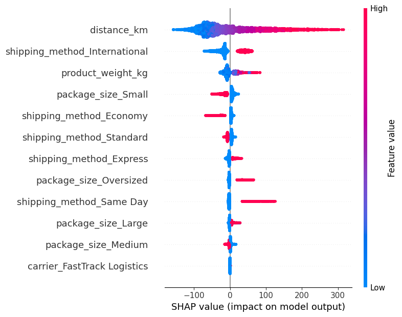

# 📦 E-Commerce Shipping Cost Intelligence Pipeline
[](https://supply-chain-shipping-cost-ml.streamlit.app/)
[](https://www.python.org/)
[](https://scikit-learn.org/)
[](https://opensource.org/licenses/MIT)
An end-to-end Machine Learning and Explainable AI (XAI) solution designed to accurately estimate e-commerce logistics and shipping costs. Featuring a dynamic interactive Streamlit dashboard, automated feature engineering, robust preprocessing pipelines, and Tree SHAP (SHapley Additive exPlanations) model explainability.
🔗 **Live Interactive App:** https://supply-chain-shipping-cost-ml.streamlit.app/
---
## Project 23:-

## 📌 Project Overview
Determining precise shipping costs in global supply chains involves multi-variable dependencies across package dimensions, fulfillment delays, carrier tariffs, regional taxes, and seasonal temporal dynamics. 
This project builds an automated end-to-end predictive machine learning pipeline that transforms raw shipment attributes into real-time cost estimations, supported by transparent feature attribution graphs via SHAP.
### Key Highlights
* **Predictive Pipeline:** Built with standard scikit-learn pipeline transformers for zero data leakage between cross-validation folds.
* **Feature Engineering:** Automated extraction of temporal indicators (`year`, `month`, `day`, `is_weekend`) and dynamic efficiency ratios (`processing_ratio`).
* **Explainable AI (XAI):** Integrated Tree SHAP framework to decompose black-box ensemble predictions into exact dollar-value feature contributions.
* **Responsive UI:** Streamlit Web Application engineered specifically for cross-device compatibility (Desktop & Mobile viewports).
---
## 📊 Model Interpretability (SHAP Analysis)
To ensure operational transparency for logistics operations, the model utilizes SHAP values based on cooperative game theory.

### Explaining the SHAP Value Breakdown
1. **Distance (km):** Serves as the primary cost driver. Increased distance directly correlates with higher fuel surcharges and transit operational overhead.
2. **Product Weight & Package Size:** Volumetric and physical weight heavily dictate air and ground freight placement fees.
3. **Shipping Method Tier:** Expedited shipping tiers (`Express`, `Same Day`) inject non-linear cost escalation due to priority handling requirements.
4. **Warehouse Processing Delay:** Long processing windows reflect operational bottlenecks, introducing inventory holding cost adjustments.
---
## 🧮 Mathematical & Algorithmic Formulations
### 1. Feature Engineering Metrics
#### Processing-to-Distance Ratio
Captures operational delay per unit of transit distance:
Processing Ratio = Warehouse Processing Time (Hours) / (Distance (km) + 1e-5)
#### Temporal Indicator Encoding
Is Weekend = 1 if DayOfWeek in [Saturday, Sunday] else 0
---
### 2. Gradient Boosting Objective Function
The core underlying predictive model optimizes an objective function consisting of a convex loss function and a regularization term to prevent overfitting:
L(θ) = ∑ l(y_i, ŷ_i) + ∑ Ω(f_k)
Where:
* l(y_i, ŷ_i) = (y_i - ŷ_i)² represents the Squared Error loss for continuous cost targets.
* Ω(f) = γT + 0.5 * λ * ∑ w_j² penalizes tree complexity (T leaves and w leaf weights).
---
### 3. Tree SHAP Attribution Formulation
The SHAP marginal contribution for feature i across all possible feature subsets S ⊆ F \ {i} is formulated as:
ϕ_i = ∑ [ |S|! * (|F| - |S| - 1)! / |F|! ] * [ f_x(S ∪ {i}) - f_x(S) ]
Where:
* F is the complete set of input features (17 engineered features).
* f_x(S) is the model expectation conditioned on feature subset S.
* ϕ_i represents the additive price impact ($ USD) contributed by feature i.
ŷ_pred = ϕ_0 + ∑ ϕ_i
---
## 🏗️ System Architecture & Features
[ User Input (Streamlit UI) ]
            │
            ▼
[ Dynamic Feature Engineering ]
  - Temporal Parsing (Year, Month, Day, Day of Week, Is Weekend)
  - Ratio Calculation (Processing Ratio)
            │
            ▼
[ Scikit-Learn Pipeline Object ]
  - OneHotEncoder (Categorical Vars)
  - RobustScaler (Continuous Vars)
  - Gradient Boosting Regressor Model
            │
            ▼
[ Predicted Shipping Cost ($ USD) + Interactive Analytics & SHAP ]
---
### Feature Dictionary Matrix

| Feature Name | Data Type | Type | Description |
| :--- | :--- | :--- | :--- |
| distance_km | Float | Continuous | Shipping distance between warehouse and destination |
| product_weight_kg | Float | Continuous | Net package weight in kilograms |
| order_value_usd | Float | Continuous | Declared commercial invoice value |
| warehouse_processing_hours | Float | Continuous | Duration spent in warehouse dispatching |
| shipping_method | Categorical | Nominal | Standard, Express, Economy, International, Same Day |
| package_size | Categorical | Ordinal | Small, Medium, Large, Oversized |
| carrier | Categorical | Nominal | FastTrack Logistics, GlobalExpress, CargoMax, etc. |
| customer_country | Categorical | Nominal | Destination country identifier |
| weather_condition | Categorical | Nominal | Transit weather status (Clear, Rain, Snow, etc.) |
| processing_ratio | Float | Engineered | Delay density per kilometer traveled |
| is_weekend | Binary | Engineered | Flag indicating order placed during weekend |

---
## 🚀 Local Installation & Deployment Guide
### Prerequisites
* Python 3.10 or higher
* Git
### Step 1: Clone Repository
```bash
git clone [https://github.com/M-Nafay-Ali/Supply-Chain-Shipping-Cost-ML.git](https://github.com/M-Nafay-Ali/Supply-Chain-Shipping-Cost-ML.git)
cd Supply-Chain-Shipping-Cost-ML
```
### Step 2: Setup Virtual Environment
```bash
# On Linux/macOS
python3 -m venv venv
source venv/bin/activate

# On Windows
python -m venv venv
venv\Scripts\activate
```
### Step 3:Install Dependencies
```bash
pip install -r requirements.txt
```
### Step 4:Run Streamlit Web Application
```bash
streamlit run app.py
```
## ⚒️ Tech Stack and Libraries
* **Core Framework:** Python 3.10+
* **Dashboard / UI:** Streamlit
* **Machine Learning:** Scikit-Learn, LightGBM / XGBoost
* **Model Explainability:** SHAP
* **Data Processing & Analytics:** Pandas, NumPy
* **Data Visualization:** Plotly Express, Plotly Graph Objects, Matplotlib

## 📞 Contact Information:-
* **Email:-**[englandengland271@gmail.com]
* **Linkedin:-**[https://www.linkedin.com/in/mohammed-nafay-ali-16519138a?utm_source=share_via&utm_content=profile&utm_medium=member_android]
* **GitHub:-**[https://github.com/M-Nafay-Ali]
